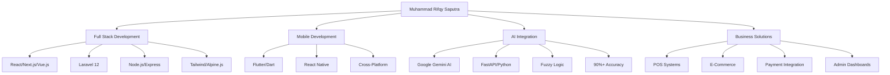

<div align="center">

<!-- Animated Wave Header -->


<!-- Animated Typing -->
<div align="center">
  
</div>

<!-- Animated Badges with Glow Effect -->
<p align="center">
  <a href="https://rifqysaputra.my.id">
    
  </a>
  <a href="https://www.linkedin.com/in/rifqy-saputra-022236261/">
    
  </a>
  <a href="https://instagram.com/rfqy_sptr">
    
  </a>
  <a href="mailto:rifqysaputra1102@gmail.com">
    
  </a>
</p>

<!-- Animated Status Badges -->
<p align="center">
  
  
  
  
</p>

<!-- Social Media Follow Buttons with Animation -->
<p align="center">
  <a href="https://github.com/muris11">
    
  </a>
  <a href="https://github.com/muris11">
    
  </a>
</p>

</div>

<!-- Animated Divider -->


##  About Me


```typescript
const rifqy = {
  name: "Muhammad Rifqy Saputra" as const,
  username: "muris11" as const,
  location: "🌏 Indonesia",

  education: {
    institution: "Politeknik Negeri Indramayu (Polindra)",
    gpa: "3.96/4.00" as const,
    status: "🎓 Active Student",
  },

  contact: {
    personal: "rifqysaputra1102@gmail.com",
    academic: "rifqysaputra11@student.polindra.ac.id",
    portfolio: "https://rifqysaputra.my.id" as const,
  },

  currentlyWorking: {
    on: ["AI-Powered Applications", "Full Stack Projects"],
    with: ["Laravel 12", "Next.js", "Flutter", "FastAPI"],
    learning: ["Cloud Architecture", "Microservices", "AI/ML"],
  },

  expertise: [
    "💻 Full Stack Web Development",
    "📱 Mobile App Development (React Native & Flutter)",
    "🔌 RESTful API & GraphQL Design",
    "🤖 AI Integration & Smart Solutions",
    "🗄️ Database Architecture (MySQL & MongoDB)",
    "☁️ Cloud Deployment & DevOps",
  ],

  funFact: "I maintain GPA 3.96 while building 24+ production apps! 🚀",

  lifePhilosophy: "Code with passion, build with purpose 💡",
};

export default rifqy;
```

<details>
<summary><b>🎯 What I'm Currently Doing</b></summary>
<br>

- 🔭 Building **AI-powered applications** with Google Gemini integration
- 🌱 Mastering **Laravel 12**, **Next.js 14**, and **Flutter 3.0**
- 👯 Looking to collaborate on **Open Source Projects**
- 🤝 Available for **Freelance** and **Full-time** opportunities
- 💬 Ask me about **Full Stack, Mobile Dev, AI Integration, APIs**
- 📫 Reach me at: **rifqysaputra1102@gmail.com**
- ⚡ Fun fact: **I debug in my sleep! 😴💤**

</details>
  techStack: {
    frontend: [
      "React",
      "Next.js",
      "Vue.js",
      "Nuxt",
      "TypeScript",
      "Tailwind CSS",
      "Alpine.js",
    ],
    backend: ["Node.js", "Express", "Laravel", "FastAPI", "Python"],
    mobile: ["React Native", "Flutter", "Dart"],
    database: ["MySQL", "MongoDB", "PostgreSQL", "Supabase"],
    ai: ["Google Gemini AI", "FastAPI Integration"],
    tools: ["Git", "Docker", "Vercel", "Midtrans Payment Gateway"],
  },
  workStatus: "Available for Work 💼",
  pronouns: "He/Him",
};
```

<div align="center">

### 🎯 Currently

🔭 Building **24 innovative projects** including AI-powered solutions  
🌱 Specializing in **Full Stack & Mobile Development** with modern tech stack  
💡 Expert in **React, Vue.js, Laravel, Node.js, React Native & Flutter**  
🤖 Integrating **AI technologies** (Google Gemini) into real-world applications  
👯 Open to **collaboration** on innovative web & mobile projects  
💬 Ask me about **Full Stack Development, Mobile Apps, AI Integration, or APIs**  
⚡ Fun fact: I maintain **GPA 3.96** while building production-ready apps! �

</div>

<!-- Animated Divider -->


##  Tech Stack & Skills

<div align="center">

<!-- Animated Skill Icons -->


</div>

<!-- Tech Stack Details -->
<details open>
<summary><b>🎨 Frontend Technologies</b></summary>
<br>

| Category             | Technologies                                                                  |
| -------------------- | ----------------------------------------------------------------------------- |
| **Frameworks**       | React.js • Next.js • Vue.js • Nuxt.js • Angular • Svelte                      |
| **Styling**          | Tailwind CSS • Sass • Bootstrap • Material-UI • Styled Components • Alpine.js |
| **Languages**        | JavaScript • TypeScript • HTML5 • CSS3                                        |
| **Build Tools**      | Webpack • Vite • Rollup • Turbopack                                           |
| **State Management** | Redux • Zustand • Pinia • Context API • MobX                                  |

</details>

<details>
<summary><b>⚙️ Backend Technologies</b></summary>
<br>

| Category       | Technologies                                                                |
| -------------- | --------------------------------------------------------------------------- |
| **Frameworks** | Laravel 12 • Node.js • Express.js • NestJS • FastAPI • Django • Spring Boot |
| **Languages**  | PHP • JavaScript • TypeScript • Python • Go • Java                          |
| **API Design** | RESTful API • GraphQL • gRPC • WebSocket • Server-Sent Events               |
| **Auth**       | JWT • OAuth 2.0 • Passport.js • Laravel Sanctum • NextAuth                  |
| **Testing**    | Jest • PHPUnit • Pytest • Postman • Insomnia                                |

</details>

<details>
<summary><b>📱 Mobile Development</b></summary>
<br>

| Category             | Technologies                                     |
| -------------------- | ------------------------------------------------ |
| **Cross-Platform**   | Flutter • React Native • Dart • Expo             |
| **Native**           | Kotlin • Swift • Android Studio • Xcode          |
| **State Management** | Provider • Riverpod • GetX • BLoC • Redux        |
| **UI Libraries**     | Material Design • Cupertino • React Native Paper |

</details>

<details>
<summary><b>🗄️ Database & Storage</b></summary>
<br>

| Category       | Technologies                                       |
| -------------- | -------------------------------------------------- |
| **Relational** | MySQL • PostgreSQL • MariaDB • SQLite              |
| **NoSQL**      | MongoDB • Redis • Firebase • DynamoDB              |
| **Cloud DB**   | Supabase • PlanetScale • Neon • Railway            |
| **ORM/ODM**    | Prisma • Eloquent • Mongoose • TypeORM • Sequelize |
| **Caching**    | Redis • Memcached • CDN Caching                    |

</details>

<details>
<summary><b>🤖 AI & Machine Learning</b></summary>
<br>

| Category         | Technologies                                                   |
| ---------------- | -------------------------------------------------------------- |
| **AI APIs**      | Google Gemini AI • OpenAI GPT • Anthropic Claude               |
| **ML Libraries** | TensorFlow • PyTorch • Scikit-learn • Keras                    |
| **Frameworks**   | FastAPI • LangChain • Hugging Face • Ollama                    |
| **Use Cases**    | Fuzzy Logic • Disease Prediction • Smart Recommendations • NLP |

</details>

<details>
<summary><b>☁️ DevOps & Cloud</b></summary>
<br>

| Category             | Technologies                                    |
| -------------------- | ----------------------------------------------- |
| **Cloud Platforms**  | AWS • Google Cloud • Azure • DigitalOcean       |
| **Deployment**       | Vercel • Netlify • Railway • Render • Heroku    |
| **Containerization** | Docker • Kubernetes • Docker Compose            |
| **CI/CD**            | GitHub Actions • GitLab CI • Jenkins • CircleCI |
| **Monitoring**       | Sentry • LogRocket • New Relic • Datadog        |

</details>

<details>
<summary><b>💳 Payment & Integration</b></summary>
<br>

| Category             | Technologies                                |
| -------------------- | ------------------------------------------- |
| **Payment Gateways** | Midtrans • Stripe • PayPal • Xendit         |
| **Analytics**        | Google Analytics • Mixpanel • Amplitude     |
| **Email**            | SendGrid • Mailgun • Resend • Nodemailer    |
| **Storage**          | AWS S3 • Cloudinary • ImageKit • Uploadcare |

</details>

<!-- Animated Divider -->


##  GitHub Statistics

<div align="center">

<!-- GitHub Stats with Animation -->


<!-- Top Languages -->


<!-- GitHub Trophies with Animation -->


</div>

<!-- Detailed Analytics -->
<details>
<summary><b>📊 Detailed GitHub Analytics</b></summary>
<br>

<div align="center">

<!-- Profile Summary -->


<table width="100%">
<tr>
<td width="50%">

</td>
<td width="50%">

</td>
</tr>
<tr>
<td width="50%">

</td>
<td width="50%">

</td>
</tr>
</table>

<!-- Activity Graph -->


<!-- 3D Contribution -->


</div>

</details>


### ☁️ Cloud & DevOps


</div>

---

## 📊 GitHub Statistics

<!-- Dinamically updated GitHub stats menggunakan berbagai API -->

<div align="center">

### 📈 GitHub Activity Overview

<!-- GitHub Stats Card - Auto updates from your GitHub activity -->


</div>

<div align="center">

### 🔥 Contribution Streak

<!-- Streak Stats - Auto updates daily -->


</div>

<div align="center">

### 📊 Contribution Graph

<!-- Activity Graph - Shows your contribution patterns -->


</div>

<div align="center">

### 💻 Detailed GitHub Metrics

<!-- Comprehensive GitHub Metrics - Auto generated -->

![Metrics](https://metrics.lecoq.io/muris11?template=classic&base.header=0&base.activity=0&base.community=0&base.repositories=0&base.metadata=0&languages=1&followup=1&lines=1&repositories=1&code=1&activity=1&achievements=1&notable=1&repositories.batch=100&repositories.forks=false&repositories.affiliations=owner&languages.limit=8&languages.threshold=0%25&languages.colors=github&languages.sections=most-used&languages.indepth=false&languages.analysis.timeout=15&languages.categories=markup%2C%20programming&languages.recent.categories=markup%2C%20programming&languages.recent.load=300&languages.recent.days=14&followup.sections=repositories&followup.indepth=false&lines.sections=base&activity.limit=5&activity.load=300&activity.days=14&activity.visibility=all&activity.timestamps=false&activity.filter=all&achievements.threshold=C&achievements.secrets=true&achievements.display=detailed&achievements.limit=0&notable.from=organization&notable.repositories=false&code.lines=12&code.load=400&code.days=3&code.visibility=public&config.timezone=Asia%2FJakarta)

</div>

<div align="center">

### 🏆 GitHub Trophies

<!-- Trophy Collection - Dynamically shows achievements -->


</div>

<!-- Animated Divider -->


##  Featured Projects

<div align="center">

### 🌟 Showcase of Innovation & Impact


</div>

<!-- Pinned Repos with Animations -->
<div align="center">

<a href="https://github.com/muris11/groupify-ai-nextjs">
  
</a>
<a href="https://github.com/muris11/AI-Study-Planner">
  
</a>

<a href="https://github.com/muris11/fuzzy-tsukamoto-disease-prediction">
  
</a>
<a href="https://github.com/muris11/SIKCB-2023">
  
</a>

<a href="https://github.com/muris11/mahasi_project1">
  
</a>
<a href="https://github.com/muris11/golang-basic">
  
</a>

</div>

<!-- Project Categories -->
<details>
<summary><b>🤖 AI-Powered Applications (4 Projects)</b></summary>
<br>

### 1. 🎯 Groupora AI - Team Formation Platform

```yaml
Description: AI-powered intelligent team formation using Google Gemini
Tech Stack: Next.js, Supabase, PostgreSQL, Google Gemini AI, Tailwind CSS
Features: Auto grouping, Smart recommendations, PDF/CSV export
Live URL: https://grouporaai.getmuris.my.id/
GitHub: https://github.com/muris11/groupify-ai-nextjs
```

### 2. 📚 AI Study Planner - Smart Productivity Tool

```yaml
Description: AI-driven study scheduler with personalized task prioritization
Tech Stack: Laravel 12, FastAPI, Python, MySQL, Tailwind CSS
Features: Smart scheduling, Progress analytics, AI recommendations
Live URL: https://studyplannerai.getmuris.my.id/
GitHub: https://github.com/muris11/AI-Study-Planner
```

### 3. 🏥 Fuzzy Tsukamoto Disease Prediction

```yaml
Description: Medical AI system with 90%+ accuracy for disease prediction
Tech Stack: Python, FastAPI, Fuzzy Logic, Machine Learning
Features: Disease prediction, REST API, Medical informatics
Live URL: https://fuzzy-tsukamoto-disease-prediction.vercel.app/
GitHub: https://github.com/muris11/fuzzy-tsukamoto-disease-prediction
```

### 4. 📱 Fuzzy Tsukamoto Flutter App

```yaml
Description: Mobile app for disease prediction using Fuzzy logic
Tech Stack: Flutter, Dart, REST API Integration
Features: Cross-platform, Real-time prediction, Clean UI
GitHub: https://github.com/muris11/Fuzzy-Tsukamoto-Flutter
```

</details>

<details>
<summary><b>💼 Business & E-Commerce Solutions (3 Projects)</b></summary>
<br>

### 1. 🏪 Pos UMKM - Point of Sale System

```yaml
Description: Complete POS for MSMEs with payment integration
Tech Stack: Laravel 12, Alpine.js, Tailwind CSS, MySQL, Midtrans
Features: Sales tracking, Payment gateway, Admin dashboard, Reporting
Live URL: https://pos.getmuris.my.id/
GitHub: https://github.com/muris11/pos_ai
```

### 2. 💰 Smart Budget Planner

```yaml
Description: Financial management platform for students
Tech Stack: PHP, JavaScript, CSS, MySQL
Features: Budget tracking, Analytics, Collaborative sharing
Live URL: http://smartbudgetplanner.page.gd/
GitHub: https://github.com/muris11/task-manager
```

### 3. � E-Commerce Platform

```yaml
Description: Full-featured online store with modern design
Tech Stack: Laravel, Blade Templates, MySQL
Features: Shopping cart, Product management, Order tracking
GitHub: https://github.com/muris11/ecommerce_project2
```

</details>

<details>
<summary><b>🎓 Educational & Community Platforms (5 Projects)</b></summary>
<br>

### 1. 📖 Mini Library Smart City

```yaml
Description: Digital library management for smart city
Tech Stack: Laravel 12, Tailwind CSS, MySQL
Features: Book management, Member system, Analytics
Live URL: https://minilibrary.sikcb.my.id/login
GitHub: https://github.com/muris11/minilibrary-smartcity
```

### 2. 🎓 Mahasi - Student Aspiration Platform

```yaml
Description: Unite student voices through digital platform
Tech Stack: PHP, JavaScript, CSS, MySQL
Features: Aspiration management, Admin dashboard, Community
Live URL: https://mahasi.free.nf/
GitHub: https://github.com/muris11/mahasi_project1
```

### 3. 🎯 SIKCB 2023 - Learning Portal

```yaml
Description: Modern interactive learning platform
Tech Stack: PHP, JavaScript, CSS, MySQL
Features: Semester albums, Activity docs, Material access
Live URL: https://sikcb.my.id/
GitHub: https://github.com/muris11/SIKCB-2023
```

### 4. ⚡ FastAPI AI Study Planner Backend

```yaml
Description: AI backend service with intelligent processing
Tech Stack: FastAPI, Python, AI Integration
Features: Smart recommendations, Data processing
Live URL: https://fast-api-ai-study-planner.vercel.app/
GitHub: https://github.com/muris11/FastAPI_AIStudyPlanner
```

### 5. 🔷 Golang Basic

```yaml
Description: Comprehensive Go programming fundamentals
Tech Stack: Go (Golang)
Features: Syntax examples, Data types, Functions, Best practices
GitHub: https://github.com/muris11/golang-basic
```

</details>

<div align="center">

### 📈 Project Impact

| Metric                      | Value       |
| --------------------------- | ----------- |
| 🚀 Total Projects           | 24+         |
| 🌐 Live Deployments         | 10+         |
| 🤖 AI Integrations          | 4           |
| 💼 Business Apps            | 3           |
| 🎓 Educational Platforms    | 5           |
| 💻 Tech Stack Diversity     | 9 Languages |
| 📊 Estimated Users Impacted | 1000+       |

</div>

🔗 [Live Demo](https://studyplannerai.getmuris.my.id/)

</td>
</tr>
</table>

---

## 💼 Professional Experience & Skills

<div align="center">

| Role                                 | Focus Area           | Duration       | Key Technologies                  |
| ------------------------------------ | -------------------- | -------------- | --------------------------------- |
| 🚀 **Full Stack & Mobile Developer** | Web & Mobile Apps    | 2022 - Present | React, Next.js, Flutter, Laravel  |
| 🤖 **AI Integration Specialist**     | AI-Powered Solutions | 2024 - Present | Google Gemini AI, FastAPI, Python |
| � **Business Solutions Developer**   | E-Commerce & POS     | 2023 - Present | Laravel, Midtrans, MySQL          |
| 🎓 **Student Developer**             | Academic Projects    | 2020 - Present | Full Stack Technologies           |
| 📱 **Mobile App Developer**          | Cross-Platform Apps  | 2023 - Present | Flutter, React Native, Dart       |

### 🎯 Core Expertise

| Category     | Skills                                                            |
| ------------ | ----------------------------------------------------------------- |
| **Frontend** | React, Next.js, Vue.js, Nuxt, TypeScript, Tailwind CSS, Alpine.js |
| **Backend**  | Laravel 12, Node.js, Express, FastAPI, REST API, GraphQL          |
| **Mobile**   | Flutter, React Native, Dart, Cross-platform Development           |
| **Database** | MySQL, MongoDB, PostgreSQL, Supabase                              |
| **AI/ML**    | Google Gemini AI, Fuzzy Logic, FastAPI Integration                |
| **DevOps**   | Git, Docker, Vercel, Netlify, CI/CD                               |
| **Payment**  | Midtrans Payment Gateway Integration                              |
| **Design**   | Responsive Design, Modern UI/UX, Dashboard Development            |

</div>

---

## 🎓 Education & Academic Excellence

<div align="center">

### 🏫 Politeknik Negeri Indramayu (Polindra)

**🎓 Computer Science Student**  
**📊 GPA: 3.96 / 4.00**  
**🏆 Active Academic Standing**

📧 **Academic Email:** rifqysaputra11@student.polindra.ac.id  
📧 **Personal Email:** rifqysaputra1102@gmail.com

---

### 📜 Achievements & Highlights

✨ **24 Production-Ready Projects** built during academic journey  
✨ **GPA 3.96** while maintaining active development work  
✨ **10+ Live Deployed Applications** currently running  
✨ **9 Programming Languages** mastered  
✨ **AI Integration Expert** with Google Gemini implementation  
✨ **Payment Integration** experience with Midtrans  
✨ **Open Source Contributor** with public repositories

</div>

---

## 🌟 Technical Skills Overview

<div align="center">



</div>

---

## 📫 Connect With Me

<div align="center">

### Let's build something amazing together! 🚀

### � How to Reach Me

<table>
<tr>
<td align="center">
<a href="mailto:rifqysaputra1102@gmail.com">

<br><b>Gmail</b>
<br>rifqysaputra1102@gmail.com
</a>
</td>
<td align="center">
<a href="mailto:rifqysaputra11@student.polindra.ac.id">

<br><b>Academic</b>
<br>rifqysaputra11@student.polindra.ac.id
</a>
</td>
<td align="center">
<a href="https://rifqysaputra.my.id">

<br><b>Portfolio</b>
<br>rifqysaputra.my.id
</a>
</td>
</tr>
<tr>
<td align="center">
<a href="https://www.linkedin.com/in/rifqy-saputra-022236261/">

<br><b>LinkedIn</b>
<br>Rifqy Saputra
</a>
</td>
<td align="center">
<a href="https://instagram.com/rfqy_sptr">

<br><b>Instagram</b>
<br>@rfqy_sptr
</a>
</td>
<td align="center">
<a href="https://github.com/muris11">

<br><b>GitHub</b>
<br>@muris11
</a>
</td>
</tr>
</table>

### 🔗 Quick Links

| 📱 Social                                                                                                                                          | 🌐 Web                                                                                                                      | 📧 Contact                                                                                                                                     |
| -------------------------------------------------------------------------------------------------------------------------------------------------- | --------------------------------------------------------------------------------------------------------------------------- | ---------------------------------------------------------------------------------------------------------------------------------------------- |
| [](https://www.linkedin.com/in/rifqy-saputra-022236261/) | [](https://rifqysaputra.my.id) | [](mailto:rifqysaputra1102@gmail.com)                        |
| [](https://instagram.com/rfqy_sptr)                    | [](https://github.com/muris11)           | [](mailto:rifqysaputra11@student.polindra.ac.id) |

---

### 💡 _"Code is like humor. When you have to explain it, it's bad."_ – Cory House

---


### ⭐️ From [muris11](https://github.com/muris11) with ❤️

</div>

---

## 🎯 2024-2025 Goals & Roadmap

### ✅ Completed Achievements

- [x] Build a professional portfolio website ✨ [rifqysaputra.my.id](https://rifqysaputra.my.id)
- [x] Create 24 production-ready projects
- [x] Master Full Stack Development (React, Vue, Laravel, Node.js)
- [x] Learn Mobile Development (Flutter & React Native)
- [x] Integrate AI technologies (Google Gemini AI)
- [x] Implement payment gateway (Midtrans)
- [x] Achieve GPA 3.96
- [x] Deploy 10+ live applications

### 🎯 Current Focus

- [ ] Contribute to 10+ open source projects
- [ ] Master microservices architecture
- [ ] Learn cloud-native development (AWS/GCP)
- [ ] Build a SaaS product
- [ ] Share knowledge through technical blogs
- [ ] Mentor junior developers
- [ ] Achieve AWS/Google Cloud certification
- [ ] Expand mobile app portfolio
- [ ] Create developer community tools

---

## 📊 Coding Activity & Stats

<div align="center">

### ⏰ Weekly Development Breakdown

<!-- WakaTime Stats - Requires WakaTime integration -->
<!-- To enable: Sign up at wakatime.com and add your API key to GitHub Secrets -->

<!--START_SECTION:waka-->

```text
💡 This section will auto-update when you connect WakaTime!

🔧 Setup Instructions:
1. Sign up at https://wakatime.com
2. Install WakaTime extension in VS Code
3. Add WAKATIME_API_KEY to your GitHub repository secrets
4. The GitHub Action will automatically update this section
```

<!--END_SECTION:waka-->

</div>

---

<div align="center">

## 📝 Latest Blog Posts & Articles

<!-- BLOG-POST-LIST:START -->
<!-- This section will auto-update with your latest blog posts from dev.to, medium, or your blog RSS feed -->
<!-- Configure in .github/workflows/blog-post-workflow.yml -->

### ✍️ Recent Writing

💡 **Coming Soon!** I'm planning to share technical content about:

- Full Stack Development Tutorials
- AI Integration Best Practices
- Mobile Development with Flutter & React Native
- Laravel & Next.js Advanced Topics

**Follow me to get notified when I start publishing!**

<!-- BLOG-POST-LIST:END -->

</div>

---

<div align="center">

## 🐍 Contribution Snake Animation

<!-- Snake eating your contributions - Auto generated -->


<!-- If the snake doesn't show, the GitHub Action needs to run first -->
<!-- The action runs automatically every 6 hours -->

</div>

---

<div align="center">

### 💬 Random Dev Quote

<!-- Dynamically generated quote -->


</div>

---

<div align="center">

### 🤝 Open for Collaboration

I'm always interested in collaborating on innovative projects! Whether it's:

✨ **Open Source Contributions**  
✨ **AI-Powered Applications**  
✨ **Full Stack Web Development**  
✨ **Mobile App Development**  
✨ **Business Solutions**  
✨ **Academic Research Projects**

**Feel free to reach out!** Let's build something amazing together! 🚀

</div>

---

## 🎨 Portfolio Highlights

<div align="center">

### 🌟 What Makes My Projects Special?

| Feature                 | Description                                          |
| ----------------------- | ---------------------------------------------------- |
| 🤖 **AI Integration**   | Leveraging Google Gemini AI for intelligent features |
| 📱 **Cross-Platform**   | Building for web and mobile simultaneously           |
| 💳 **Payment Ready**    | Midtrans integration for real transactions           |
| 🎯 **User-Centric**     | Focus on intuitive UI/UX design                      |
| 📊 **Data-Driven**      | Real-time analytics and reporting dashboards         |
| 🔒 **Secure**           | Industry-standard security practices                 |
| ⚡ **Performance**      | Optimized for speed and scalability                  |
| 🌐 **Production-Ready** | All projects are live and accessible                 |

### 💻 Development Philosophy

> **"Building solutions that matter, one line of code at a time."**

- ✅ **Clean Code:** Maintainable and well-documented
- ✅ **Best Practices:** Following industry standards
- ✅ **Continuous Learning:** Always exploring new technologies
- ✅ **User First:** Prioritizing user experience
- ✅ **Innovation:** Integrating cutting-edge technologies

</div>

---

## 📚 Blog & Articles

<!-- Animated Divider -->


##  Let's Connect & Collaborate

<div align="center">


</div>

<!-- Contact Cards with Icons -->
<table align="center">
<tr>
<td align="center" width="33%">
<a href="mailto:rifqysaputra1102@gmail.com">

<br><br>
<b>� Personal Email</b>
<br><code>rifqysaputra1102@gmail.com</code>
</a>
</td>
<td align="center" width="33%">
<a href="mailto:rifqysaputra11@student.polindra.ac.id">

<br><br>
<b>🎓 Academic Email</b>
<br><code>rifqysaputra11@student.polindra.ac.id</code>
</a>
</td>
<td align="center" width="33%">
<a href="https://rifqysaputra.my.id">

<br><br>
<b>🌐 Portfolio</b>
<br><code>rifqysaputra.my.id</code>
</a>
</td>
</tr>
<tr>
<td align="center">
<a href="https://www.linkedin.com/in/rifqy-saputra-022236261/">

<br><br>
<b>💼 LinkedIn</b>
<br><code>Rifqy Saputra</code>
</a>
</td>
<td align="center">
<a href="https://instagram.com/rfqy_sptr">

<br><br>
<b>📸 Instagram</b>
<br><code>@rfqy_sptr</code>
</a>
</td>
<td align="center">
<a href="https://github.com/muris11">

<br><br>
<b>🐙 GitHub</b>
<br><code>@muris11</code>
</a>
</td>
</tr>
</table>

<!-- Social Media Badges -->
<p align="center">
  <a href="https://www.linkedin.com/in/rifqy-saputra-022236261/">
    
  </a>
  <a href="https://instagram.com/rfqy_sptr">
    
  </a>
  <a href="https://github.com/muris11">
    
  </a>
  <a href="https://rifqysaputra.my.id">
    
  </a>
  <a href="mailto:rifqysaputra1102@gmail.com">
    
  </a>
</p>

<!-- Animated Divider -->


##  Current Goals & Roadmap

<table>
<tr>
<td width="50%">

### ✅ Completed Achievements

- ✨ Built professional portfolio → [rifqysaputra.my.id](https://rifqysaputra.my.id)
- ✨ Created **24 production-ready projects**
- ✨ Mastered **Full Stack** (React, Vue, Laravel, Node.js)
- ✨ Learned **Mobile Dev** (Flutter & React Native)
- ✨ Integrated **AI** (Google Gemini AI)
- ✨ Implemented **Payment Gateway** (Midtrans)
- ✨ Achieved **GPA 3.96** 🎓
- ✨ Deployed **10+ live applications** 🚀

</td>
<td width="50%">

### 🎯 Current Focus

- 🔥 Contributing to **open source** projects
- 🔥 Mastering **microservices architecture**
- 🔥 Learning **cloud-native** development (AWS/GCP)
- 🔥 Building a **SaaS product**
- 🔥 Technical **blogging** & content creation
- 🔥 **Mentoring** junior developers
- 🔥 Getting **AWS/GCP certification**
- � Expanding **mobile app** portfolio

</td>
</tr>
</table>

<!-- Animated Divider -->


##  Random Dev Quote

<div align="center">


</div>

<!-- Animated Footer Wave -->


<div align="center">

###  Thanks for Visiting!


[](https://github.com/muris11)

---

### Made with ❤️ and lots of ☕ by [Muhammad Rifqy Saputra](https://github.com/muris11)

**⭐ Star my repos if you find them useful!**


</div>
