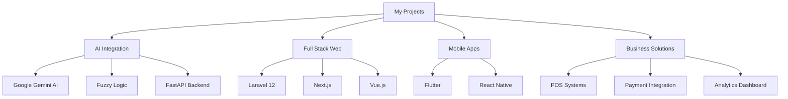
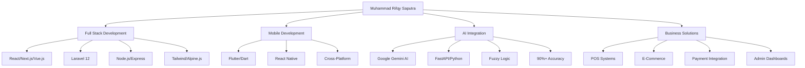

<div align="center">
  
# 👋 Hi, I'm Muhammad Rifqy Saputra

### 💻 Full Stack & Mobile Developer | 🎓 GPA 3.96 | 🚀 Available for Work

[](https://rifqysaputra.my.id)
[](https://www.linkedin.com/in/rifqy-saputra-022236261/)
[](https://instagram.com/rfqy_sptr)
[](mailto:rifqysaputra1102@gmail.com)


</div>

---

## 🚀 About Me

```javascript
const rifqy = {
  name: "Muhammad Rifqy Saputra",
  username: "muris11",
  location: "Indonesia 🇮🇩",
  education: {
    institution: "Politeknik Negeri Indramayu (Polindra)",
    gpa: "3.96/4.00",
    status: "Active Student",
  },
  email: {
    personal: "rifqysaputra1102@gmail.com",
    academic: "rifqysaputra11@student.polindra.ac.id",
  },
  portfolio: "https://rifqysaputra.my.id",
  stats: {
    totalProjects: 24,
    totalStars: 0,
    totalForks: 0,
    languagesUsed: 9,
  },
  expertise: [
    "Full Stack Web Development",
    "Mobile App Development (React Native & Flutter)",
    "RESTful API & GraphQL Design",
    "AI Integration & Smart Solutions",
    "Database Architecture (MySQL & MongoDB)",
    "Cloud Deployment & DevOps",
  ],
  currentFocus: [
    "Building AI-Powered Applications",
    "Laravel 12 & Next.js Development",
    "Mobile Development with Flutter & React Native",
    "FastAPI & Python Backend",
  ],
  techStack: {
    frontend: [
      "React",
      "Next.js",
      "Vue.js",
      "Nuxt",
      "TypeScript",
      "Tailwind CSS",
      "Alpine.js",
    ],
    backend: ["Node.js", "Express", "Laravel", "FastAPI", "Python"],
    mobile: ["React Native", "Flutter", "Dart"],
    database: ["MySQL", "MongoDB", "PostgreSQL", "Supabase"],
    ai: ["Google Gemini AI", "FastAPI Integration"],
    tools: ["Git", "Docker", "Vercel", "Midtrans Payment Gateway"],
  },
  workStatus: "Available for Work 💼",
  pronouns: "He/Him",
};
```

<div align="center">

### 🎯 Currently

🔭 Building **24 innovative projects** including AI-powered solutions  
🌱 Specializing in **Full Stack & Mobile Development** with modern tech stack  
💡 Expert in **React, Vue.js, Laravel, Node.js, React Native & Flutter**  
🤖 Integrating **AI technologies** (Google Gemini) into real-world applications  
👯 Open to **collaboration** on innovative web & mobile projects  
💬 Ask me about **Full Stack Development, Mobile Apps, AI Integration, or APIs**  
⚡ Fun fact: I maintain **GPA 3.96** while building production-ready apps! �

</div>

---

## 🛠️ Tech Stack

<div align="center">

### 💻 Programming Languages


### 🎨 Frontend Development


### 📱 Mobile Development


### ⚙️ Backend Development


### 🗄️ Database & Storage


### 🤖 AI & Machine Learning


### ☁️ Cloud & DevOps


### 💳 Payment Integration


### 🔧 Tools & Technologies


</div>

---

## 📊 GitHub Statistics

<div align="center">
  


</div>

<div align="center">
  


</div>

<div align="center">


</div>

---

## 🏆 GitHub Trophies

<div align="center">


</div>

---

## 📈 Contribution Activity

<div align="center">


</div>

---

## 🔥 Featured Projects

### 🤖 AI-Powered Applications

<table>
<tr>
<td width="50%">

#### 🎯 [Groupora AI](https://github.com/muris11/groupify-ai-nextjs)

**AI-Powered Team Formation Platform**

An intelligent team formation platform using Google Gemini AI to automatically create balanced, efficient groups. Built with Next.js, Supabase, and PostgreSQL.

**Tech Stack:**

- Next.js & React
- Supabase & PostgreSQL
- Google Gemini AI
- Tailwind CSS

🔗 [Live Demo](https://grouporaai.getmuris.my.id/)

</td>
<td width="50%">

#### 📚 [AI Study Planner](https://github.com/muris11/AI-Study-Planner)

**Intelligent Productivity Platform**

AI-driven study planner with smart scheduling, progress analytics, and personalized task prioritization powered by FastAPI integration.

**Tech Stack:**

- Laravel 12
- FastAPI & Python
- Tailwind CSS
- MySQL

🔗 [Live Demo](https://studyplannerai.getmuris.my.id/)

</td>
</tr>
</table>

### 💼 Business & E-Commerce Solutions

<table>
<tr>
<td width="50%">

#### 🏪 [Pos UMKM](https://github.com/muris11/pos_ai)

**MSME Point of Sale System**

Complete POS system for local businesses with Midtrans payment integration, real-time transaction tracking, and comprehensive admin dashboard.

**Tech Stack:**

- Laravel 12
- Alpine.js
- Tailwind CSS
- MySQL
- Midtrans Payment

🔗 [Live Demo](https://pos.getmuris.my.id/)

</td>
<td width="50%">

#### 💰 [Smart Budget Planner](https://github.com/muris11/task-manager)

**Financial Management Platform**

Student-driven financial tool with real-time analytics, AI-assisted recommendations, and collaborative budget sharing features.

**Tech Stack:**

- PHP
- JavaScript
- CSS
- MySQL

🔗 [Live Demo](http://smartbudgetplanner.page.gd/)

</td>
</tr>
</table>

### 🎓 Educational & Community Platforms

<table>
<tr>
<td width="50%">

#### 📖 [Mini Library Smart City](https://github.com/muris11/minilibrary-smartcity)

**Digital Library Management**

Modern library management system with intuitive admin dashboard and real-time data integration for smart city initiatives.

**Tech Stack:**

- Laravel 12
- Tailwind CSS
- MySQL

🔗 [Live Demo](https://minilibrary.sikcb.my.id/login)

</td>
<td width="50%">

#### 🎓 [Mahasi](https://github.com/muris11/mahasi_project1)

**Student Aspiration Platform**

Full-stack platform to unite student aspirations, featuring admin dashboard, interactive features, and community engagement tools.

**Tech Stack:**

- PHP
- JavaScript
- CSS
- MySQL

🔗 [Live Demo](https://mahasi.free.nf/)

</td>
</tr>
</table>

### 🔬 Research & Innovation

<table>
<tr>
<td width="50%">

#### 🏥 [Fuzzy Tsukamoto Disease Prediction](https://github.com/muris11/fuzzy-tsukamoto-disease-prediction)

**Medical AI System**

Academic medical informatics project with 90%+ accuracy for common disease prediction using Fuzzy Tsukamoto logic with REST API.

**Tech Stack:**

- Python
- FastAPI
- Machine Learning
- Fuzzy Logic

🔗 [Live Demo](https://fuzzy-tsukamoto-disease-prediction.vercel.app/)

</td>
<td width="50%">

#### 📱 [Fuzzy Tsukamoto Flutter](https://github.com/muris11/Fuzzy-Tsukamoto-Flutter)

**Mobile Medical App**

Flutter-based mobile application for disease prediction using Fuzzy Tsukamoto algorithm.

**Tech Stack:**

- Flutter
- Dart
- REST API Integration

</td>
</tr>
</table>

### 🌐 Web Development Projects

<table>
<tr>
<td width="50%">

#### 🎯 [SIKCB 2023](https://github.com/muris11/SIKCB-2023)

**Interactive Learning Portal**

Modern learning portal with semester album management, activity documentation, and community features for academic journey.

**Tech Stack:**

- PHP
- JavaScript
- CSS
- MySQL

🔗 [Live Demo](https://sikcb.my.id/)

</td>
<td width="50%">

#### 🛒 [E-Commerce Project](https://github.com/muris11/ecommerce_project2)

**Modern E-Commerce Platform**

Full-featured e-commerce solution with shopping cart, payment integration, and admin panel.

**Tech Stack:**

- Laravel
- Blade Templates
- MySQL

</td>
</tr>
</table>

### 💻 Learning & Development

<table>
<tr>
<td width="50%">

#### 🔷 [Golang Basic](https://github.com/muris11/golang-basic)

**Go Programming Fundamentals**

Comprehensive collection of Go programming basics including syntax, data types, functions, and best practices for beginners.

**Tech Stack:**

- Go (Golang)
- Basic Programming Concepts

</td>
<td width="50%">

#### ⚡ [FastAPI AI Study Planner Backend](https://github.com/muris11/FastAPI_AIStudyPlanner)

**AI Backend Service**

FastAPI backend service for AI Study Planner with intelligent recommendations and data processing.

**Tech Stack:**

- FastAPI
- Python
- AI Integration

🔗 [Live Demo](https://fast-api-ai-study-planner.vercel.app/)

</td>
</tr>
</table>

---

## 📊 Project Statistics

<div align="center">

| Metric                  | Count            |
| ----------------------- | ---------------- |
| 📁 Total Repositories   | **24**           |
| ⭐ Total Stars          | **0** (Growing!) |
| 🔀 Total Forks          | **0**            |
| 💻 Languages Used       | **9**            |
| 🚀 Live Deployments     | **10+**          |
| 🤖 AI Projects          | **4**            |
| 💼 Business Apps        | **3**            |
| 🎓 Educational Projects | **5**            |

</div>

---

## 💡 Project Highlights

<div align="center">

### 🎯 Specialized In



</div>

<div align="center">

### 🏆 Key Achievements

✅ Built **24 production-ready projects**  
✅ Integrated **Google Gemini AI** in multiple applications  
✅ Implemented **Midtrans payment gateway**  
✅ Achieved **90%+ accuracy** in medical AI prediction  
✅ Deployed **10+ live applications**  
✅ Mastered **9 programming languages**  
✅ Maintained **GPA 3.96** while building all projects

</div>

---

## 💼 Professional Experience & Skills

<div align="center">

| Role                                 | Focus Area           | Duration       | Key Technologies                  |
| ------------------------------------ | -------------------- | -------------- | --------------------------------- |
| 🚀 **Full Stack & Mobile Developer** | Web & Mobile Apps    | 2022 - Present | React, Next.js, Flutter, Laravel  |
| 🤖 **AI Integration Specialist**     | AI-Powered Solutions | 2024 - Present | Google Gemini AI, FastAPI, Python |
| � **Business Solutions Developer**   | E-Commerce & POS     | 2023 - Present | Laravel, Midtrans, MySQL          |
| 🎓 **Student Developer**             | Academic Projects    | 2020 - Present | Full Stack Technologies           |
| 📱 **Mobile App Developer**          | Cross-Platform Apps  | 2023 - Present | Flutter, React Native, Dart       |

### 🎯 Core Expertise

| Category     | Skills                                                            |
| ------------ | ----------------------------------------------------------------- |
| **Frontend** | React, Next.js, Vue.js, Nuxt, TypeScript, Tailwind CSS, Alpine.js |
| **Backend**  | Laravel 12, Node.js, Express, FastAPI, REST API, GraphQL          |
| **Mobile**   | Flutter, React Native, Dart, Cross-platform Development           |
| **Database** | MySQL, MongoDB, PostgreSQL, Supabase                              |
| **AI/ML**    | Google Gemini AI, Fuzzy Logic, FastAPI Integration                |
| **DevOps**   | Git, Docker, Vercel, Netlify, CI/CD                               |
| **Payment**  | Midtrans Payment Gateway Integration                              |
| **Design**   | Responsive Design, Modern UI/UX, Dashboard Development            |

</div>

---

## 🎓 Education & Academic Excellence

<div align="center">

### 🏫 Politeknik Negeri Indramayu (Polindra)

**🎓 Computer Science Student**  
**📊 GPA: 3.96 / 4.00**  
**🏆 Active Academic Standing**

📧 **Academic Email:** rifqysaputra11@student.polindra.ac.id  
📧 **Personal Email:** rifqysaputra1102@gmail.com

---

### 📜 Achievements & Highlights

✨ **24 Production-Ready Projects** built during academic journey  
✨ **GPA 3.96** while maintaining active development work  
✨ **10+ Live Deployed Applications** currently running  
✨ **9 Programming Languages** mastered  
✨ **AI Integration Expert** with Google Gemini implementation  
✨ **Payment Integration** experience with Midtrans  
✨ **Open Source Contributor** with public repositories

</div>

---

## 🌟 Technical Skills Overview

<div align="center">



</div>

---

## 📫 Connect With Me

<div align="center">

### Let's build something amazing together! 🚀

### � How to Reach Me

<table>
<tr>
<td align="center">
<a href="mailto:rifqysaputra1102@gmail.com">

<br><b>Gmail</b>
<br>rifqysaputra1102@gmail.com
</a>
</td>
<td align="center">
<a href="mailto:rifqysaputra11@student.polindra.ac.id">

<br><b>Academic</b>
<br>rifqysaputra11@student.polindra.ac.id
</a>
</td>
<td align="center">
<a href="https://rifqysaputra.my.id">

<br><b>Portfolio</b>
<br>rifqysaputra.my.id
</a>
</td>
</tr>
<tr>
<td align="center">
<a href="https://www.linkedin.com/in/rifqy-saputra-022236261/">

<br><b>LinkedIn</b>
<br>Rifqy Saputra
</a>
</td>
<td align="center">
<a href="https://instagram.com/rfqy_sptr">

<br><b>Instagram</b>
<br>@rfqy_sptr
</a>
</td>
<td align="center">
<a href="https://github.com/muris11">

<br><b>GitHub</b>
<br>@muris11
</a>
</td>
</tr>
</table>

### 🔗 Quick Links

| 📱 Social                                                                                                                                          | 🌐 Web                                                                                                                      | 📧 Contact                                                                                                                                     |
| -------------------------------------------------------------------------------------------------------------------------------------------------- | --------------------------------------------------------------------------------------------------------------------------- | ---------------------------------------------------------------------------------------------------------------------------------------------- |
| [](https://www.linkedin.com/in/rifqy-saputra-022236261/) | [](https://rifqysaputra.my.id) | [](mailto:rifqysaputra1102@gmail.com)                        |
| [](https://instagram.com/rfqy_sptr)                    | [](https://github.com/muris11)           | [](mailto:rifqysaputra11@student.polindra.ac.id) |

---

### 💡 _"Code is like humor. When you have to explain it, it's bad."_ – Cory House

---


### ⭐️ From [muris11](https://github.com/muris11) with ❤️

</div>

---

## 🎯 2024-2025 Goals & Roadmap

### ✅ Completed Achievements

- [x] Build a professional portfolio website ✨ [rifqysaputra.my.id](https://rifqysaputra.my.id)
- [x] Create 24 production-ready projects
- [x] Master Full Stack Development (React, Vue, Laravel, Node.js)
- [x] Learn Mobile Development (Flutter & React Native)
- [x] Integrate AI technologies (Google Gemini AI)
- [x] Implement payment gateway (Midtrans)
- [x] Achieve GPA 3.96
- [x] Deploy 10+ live applications

### 🎯 Current Focus

- [ ] Contribute to 10+ open source projects
- [ ] Master microservices architecture
- [ ] Learn cloud-native development (AWS/GCP)
- [ ] Build a SaaS product
- [ ] Share knowledge through technical blogs
- [ ] Mentor junior developers
- [ ] Achieve AWS/Google Cloud certification
- [ ] Expand mobile app portfolio
- [ ] Create developer community tools

---

<div align="center">

### 📊 Weekly Development Breakdown

<!--START_SECTION:waka-->
<!--END_SECTION:waka-->

</div>

---

<div align="center">

## 🐍 Contribution Snake


</div>

---

<div align="center">

### 💬 Random Dev Quote


</div>

---

<div align="center">

### 🤝 Open for Collaboration

I'm always interested in collaborating on innovative projects! Whether it's:

✨ **Open Source Contributions**  
✨ **AI-Powered Applications**  
✨ **Full Stack Web Development**  
✨ **Mobile App Development**  
✨ **Business Solutions**  
✨ **Academic Research Projects**

**Feel free to reach out!** Let's build something amazing together! 🚀

</div>

---

## 🎨 Portfolio Highlights

<div align="center">

### 🌟 What Makes My Projects Special?

| Feature                 | Description                                          |
| ----------------------- | ---------------------------------------------------- |
| 🤖 **AI Integration**   | Leveraging Google Gemini AI for intelligent features |
| 📱 **Cross-Platform**   | Building for web and mobile simultaneously           |
| 💳 **Payment Ready**    | Midtrans integration for real transactions           |
| 🎯 **User-Centric**     | Focus on intuitive UI/UX design                      |
| 📊 **Data-Driven**      | Real-time analytics and reporting dashboards         |
| 🔒 **Secure**           | Industry-standard security practices                 |
| ⚡ **Performance**      | Optimized for speed and scalability                  |
| 🌐 **Production-Ready** | All projects are live and accessible                 |

### 💻 Development Philosophy

> **"Building solutions that matter, one line of code at a time."**

- ✅ **Clean Code:** Maintainable and well-documented
- ✅ **Best Practices:** Following industry standards
- ✅ **Continuous Learning:** Always exploring new technologies
- ✅ **User First:** Prioritizing user experience
- ✅ **Innovation:** Integrating cutting-edge technologies

</div>

---

## 📚 Blog & Articles

<div align="center">

### ✍️ Coming Soon: Technical Writing

I'm planning to share my development journey through:

- 📝 **Technical Tutorials** on Full Stack Development
- 🤖 **AI Integration Guides** with real-world examples
- 📱 **Mobile Development** best practices
- 💡 **Project Case Studies** from my portfolio
- 🔧 **Tips & Tricks** for Laravel, React, and Flutter

**Stay tuned!** Follow me to get notified when I start publishing.

</div>

---

## 🏆 GitHub Achievements

<div align="center">

### 🎯 Milestones


</div>

---

<div align="center">
  
**Thank you for visiting my profile! Feel free to explore my repositories and reach out for collaborations.** 🚀

---

### 💡 _"The only way to do great work is to love what you do."_ – Steve Jobs

---


### ⭐️ From [muris11](https://github.com/muris11) | Built with ❤️ and ☕

**Happy Coding! 💻✨**

</div>
