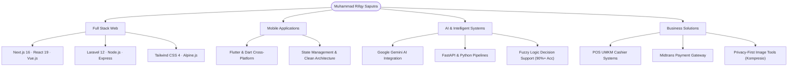
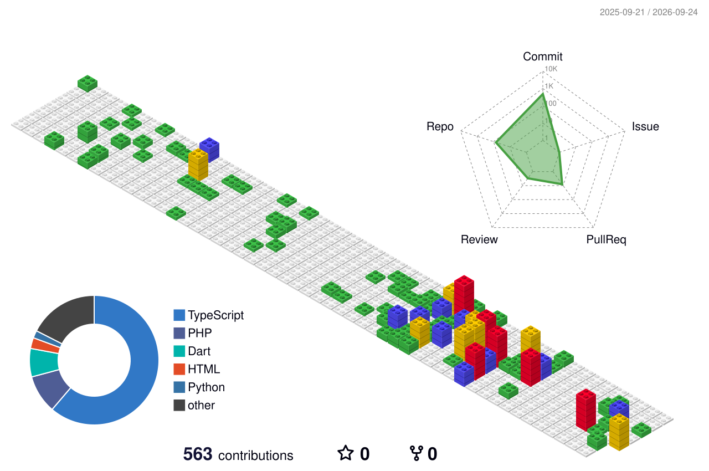

<div align="center">

<!-- Animated Wave Header -->


<!-- Animated Typing Tagline -->
<div align="center">
  
</div>

<!-- Primary Navigation Badges -->
<p align="center">
  <a href="https://www.rifqysaputra.dev/">
    
  </a>
  <a href="https://www.linkedin.com/in/muhammad-rifqy-saputra/">
    
  </a>
  <a href="https://instagram.com/rfqy_sptr">
    
  </a>
  <a href="mailto:rifqysaputra1102@gmail.com">
    
  </a>
</p>

<!-- Live Status Badges -->
<p align="center">
  
  
  
  
  
</p>

<!-- Social Counts -->
<p align="center">
  <a href="https://github.com/muris11?tab=followers">
    
  </a>
  <a href="https://github.com/muris11">
    
  </a>
</p>

</div>

<!-- Animated Divider -->


##  About Me

<a href="https://storyset.com/illustration/javascript-frameworks/amico"></a>

I'm an undergraduate student pursuing a D4 in **Smart City Information Systems** at [Politeknik Negeri Indramayu](https://www.polindra.ac.id/) with a current GPA of **3.98 / 4.00**. I specialize in turning real-world business challenges into robust, intuitive software products—spanning scalable full-stack web applications, cross-platform mobile apps, and practical AI integrations.

During my academic journey, I served as **Head of Research &amp; Development** at HIMA-SIKC, leading strategic engineering initiatives, orchestrating tech workshops, and mentoring fellow developers. My work ranges from multi-store POS and e-commerce architectures to decision-support systems utilizing fuzzy logic and modern machine learning pipelines.

- **Building:** Full-stack systems, mobile apps, practical AI workflows, and developer tools
- **Exploring:** Cloud architecture, microservices, and agentic AI systems
- **Ask me about:** Laravel 12, Next.js 16, Flutter, REST/GraphQL APIs, and system design
- **Key highlight:** Maintained a 3.98 GPA while actively developing production-ready software.

<br clear="right" />

```typescript
const rifqy: Developer = {
  name: "Muhammad Rifqy Saputra",
  username: "muris11",
  role: "Full Stack & Mobile Developer | AI Integration",
  education: {
    institution: "Politeknik Negeri Indramayu (Polindra)",
    major: "D4 Smart City Information Systems",
    gpa: "3.98 / 4.00",
    status: "Active Student & Tech Lead",
  },
  location: "Indonesia",
  contact: {
    email: "rifqysaputra1102@gmail.com",
    academic: "rifqysaputra11@student.polindra.ac.id",
    portfolio: "https://www.rifqysaputra.dev",
  },
  focusAreas: [
    "Full-Stack Web Architecture (Next.js 16, React 19, Laravel 12)",
    "Cross-Platform Mobile Applications (Flutter & Dart)",
    "Practical AI & Decision Systems (Gemini AI, FastAPI, Fuzzy Logic)",
    "Cloud Microservices & Scalable Deployment (Docker, CI/CD)",
  ],
  lifePhilosophy: "Code with passion, build with purpose.",
};

export default rifqy;
```

<details>
<summary> <b>What I'm Currently Doing &amp; Learning</b></summary>
<br>

- Building **AI-powered applications** with Google Gemini and autonomous agent workflows
- Shipping **Kompresio** (privacy-first image toolkit) and **POS UMKM** (multi-store cashier platform)
- Maintaining **[anti-ai-slop](https://github.com/muris11/anti-ai-slop)**, an open-source toolkit with 17 agent skills
- Open to **freelance engagements**, **internships**, and **full-stack software collaborations**
- Direct inquiries: **rifqysaputra1102@gmail.com**

</details>

<!-- Animated Divider -->


##  Tech Stack &amp; Skills

<!-- Core Technology Shields -->
<p align="center">
  
  
  
  
  
  
  
  
  
  
  
  
</p>

<!-- 64 Categorized Skill Icons -->
<div align="center">

<br>
<br>
<br>
<br>
<br>
<br>
<br>


</div>

<br>

<details open>
<summary> <b>Frontend Technologies</b></summary>
<br>

| Category | Technologies &amp; Libraries |
|---|---|
| **Frameworks &amp; Core** | React 19, Next.js 16, Vue.js 3, Nuxt.js, Angular, Svelte, TypeScript, JavaScript (ESNext) |
| **Styling &amp; Design** | Tailwind CSS 4, Alpine.js, Sass, Bootstrap, Material-UI, Styled Components, Responsive UI/UX |
| **Tooling &amp; Testing** | Vite, Turbopack, Vitest, Webpack, Rollup, ESLint, Prettier |
| **State Management** | Zustand, Redux Toolkit, Pinia, Context API |

</details>

<details>
<summary> <b>Backend &amp; API Engineering</b></summary>
<br>

| Category | Technologies &amp; Architecture |
|---|---|
| **Frameworks** | Laravel 12, Node.js, Express.js, FastAPI (Python), NestJS, Django, Spring Boot |
| **Languages** | PHP 8.x, TypeScript, Python 3.x, Go (Golang), Java, C++, Rust |
| **API Standards** | RESTful APIs, GraphQL, Server-Sent Events, WebSockets, gRPC |
| **Auth &amp; Security** | JWT, Laravel Sanctum, Passport.js, OAuth 2.0, NextAuth / Auth.js, CORS &amp; Rate Limiting |
| **Testing** | PHPUnit, Pest, Pytest, Jest, Postman, Insomnia |

</details>

<details>
<summary> <b>Mobile Application Development</b></summary>
<br>

| Category | Technologies &amp; Frameworks |
|---|---|
| **Cross-Platform** | Flutter &amp; Dart, React Native, Expo |
| **Native Tooling** | Android Studio, Kotlin, Swift, Xcode |
| **State Management** | Provider, Riverpod, BLoC, GetX |
| **Platform Services** | Firebase Auth/Firestore, REST Client, Offline Caching, Device APIs, Push Notifications |

</details>

<details>
<summary> <b>Database &amp; Cloud Storage</b></summary>
<br>

| Category | Engines &amp; ORMs |
|---|---|
| **Relational (SQL)** | MySQL, PostgreSQL, SQLite, MariaDB, Neon, PlanetScale |
| **NoSQL &amp; Realtime** | Supabase, Firebase Firestore, MongoDB, Redis, DynamoDB |
| **ORM / Query Builders** | Eloquent (Laravel), Prisma, Mongoose, TypeORM, Supabase Client |
| **Caching** | Redis, Memcached, CDN edge caching |

</details>

<details>
<summary> <b>AI &amp; Intelligent Systems</b></summary>
<br>

| Category | Technologies &amp; Implementations |
|---|---|
| **Large Language Models** | Google Gemini API, OpenAI API, Anthropic Claude |
| **Pipelines &amp; Frameworks** | FastAPI AI microservices, LangChain, Hugging Face, Python ML ecosystem |
| **Decision Science** | Fuzzy Logic (Tsukamoto &amp; Mamdani), Medical Diagnostic Models, Smart Recommenders |

</details>

<details>
<summary> <b>DevOps, Cloud &amp; Infrastructure</b></summary>
<br>

| Category | Platforms &amp; Workflows |
|---|---|
| **Containerization** | Docker, Docker Compose, Kubernetes |
| **CI / CD Pipelines** | GitHub Actions (automated testing, linting, asset generation), GitLab CI |
| **Cloud Hosting** | Vercel, Railway, Render, Supabase Cloud, AWS, Google Cloud, DigitalOcean |
| **Environment** | Linux (Ubuntu), Bash, PowerShell, Git version control, Vim |

</details>

<details>
<summary> <b>Payments &amp; Integrations</b></summary>
<br>

| Category | Services &amp; Tools |
|---|---|
| **Payment Gateways** | Midtrans Payment Gateway (Snap &amp; Core API), Stripe |
| **Media &amp; Storage** | Cloudinary, ImageKit, AWS S3, Vercel Blob |
| **Communication** | Resend, SendGrid, Nodemailer, REST Webhooks |

</details>

<!-- Animated Divider -->


##  Technical Architecture


```mermaid
graph TB
    Me(["Muhammad Rifqy Saputra"]) --> FullStack["Full Stack Web"]
    Me --> Mobile["Mobile Applications"]
    Me --> AI["AI & Intelligent Systems"]
    Me --> Biz["Business Solutions"]

    FullStack --> F1["Next.js 16 · React 19 · Vue.js"]
    FullStack --> F2["Laravel 12 · Node.js · Express"]
    FullStack --> F3["Tailwind CSS 4 · Alpine.js"]

    Mobile --> M1["Flutter & Dart Cross-Platform"]
    Mobile --> M2["State Management & Clean Architecture"]

    AI --> A1["Google Gemini AI Integration"]
    AI --> A2["FastAPI & Python Pipelines"]
    AI --> A3["Fuzzy Logic Decision Support (90%+ Acc)"]

    Biz --> B1["POS UMKM Cashier Systems"]
    Biz --> B2["Midtrans Payment Gateway"]
    Biz --> B3["Privacy-First Image Tools (Kompresio)"]
```

<!-- Animated Divider -->


##  Featured Projects &amp; Showcase

<div align="center">

<a href="https://github.com/muris11/kompresio">
  
</a>
<a href="https://github.com/muris11/anti-ai-slop">
  
</a>

<a href="https://github.com/muris11/Pos-UMKM-Laravel-12">
  
</a>
<a href="https://github.com/muris11/groupify-ai-nextjs">
  
</a>

<a href="https://github.com/muris11/AI-Study-Planner">
  
</a>
<a href="https://github.com/muris11/fuzzy-tsukamoto-disease-prediction">
  
</a>

</div>

<br>

### 1. [Kompresio](https://kompresio-nextjs.vercel.app/) — Privacy-First Image Toolkit

<a href="https://kompresio-nextjs.vercel.app/"></a>

A modern, high-performance in-browser image optimization application. Offers intelligent compression, format conversion (WebP, PNG, JPEG, AVIF), bulk resizing, EXIF cleanup, batch ZIP packaging, and image-to-PDF generation—running 100% on the client side with zero cloud uploads.

- **Stack:** Next.js 16, React 19, TypeScript, Tailwind CSS 4, Vitest
- **Highlights:** Client-side privacy-first architecture, drag-and-drop batch processing, zero server costs
- **Links:** [Live Demo](https://kompresio-nextjs.vercel.app/) · [Source Code](https://github.com/muris11/kompresio)

<br clear="right" />

### 2. [POS UMKM](https://github.com/muris11/Pos-UMKM-Laravel-12) — Enterprise MSME Point of Sale

A complete point-of-sale management system built specifically for Indonesian small-to-medium businesses. Features real-time multi-outlet stock tracking, rapid barcode cashier workflows, dynamic sales analytics, PDF receipt generation, and integrated online checkout via Midtrans.

- **Stack:** Laravel 12, PHP 8.2+, MySQL, Tailwind CSS, Alpine.js, Midtrans SDK
- **Highlights:** Multi-store role-based access, cash &amp; cashless Midtrans transactions, daily profit analytics
- **Links:** [Source Code](https://github.com/muris11/Pos-UMKM-Laravel-12)

### 3. [anti-ai-slop](https://github.com/muris11/anti-ai-slop) — AI Coding Agent Quality Guardrails

An open-source quality filter and prompt harness for AI coding assistants (Claude Code, Cursor, Copilot). Prevents generic boilerplate, repetitive AI tropes, low-contrast designs, and sloppy code comments while promoting distinctive, intentional engineering choices.

<a href="https://github.com/muris11/anti-ai-slop"></a>

- **Stack:** 17 Agent Skills, Bash CLI Installer, GitHub Actions CI
- **Highlights:** Zero runtime dependencies, community-tested across real developer workflows
- **Links:** [Source Code](https://github.com/muris11/anti-ai-slop) · [Install via skills.sh](https://www.skills.sh/muris11/anti-ai-slop)

<br>

<details open>
<summary> <b>AI-Powered Applications (Detailed Specifications)</b></summary>
<br>

#### 1. Groupora AI — Intelligent Team Formation Platform
```yaml
Name: Groupora AI (Groupify AI)
Description: AI-powered intelligent team formation using Google Gemini AI
Tech Stack: Next.js, Supabase, PostgreSQL, Google Gemini AI, Tailwind CSS
Features: Automated personality/skill clustering, smart group recommendations, PDF/CSV export
Repository: https://github.com/muris11/groupify-ai-nextjs
```

#### 2. Fuzzy Tsukamoto Disease Prediction
```yaml
Name: Fuzzy Tsukamoto Disease Prediction System
Description: Clinical decision-support system implementing Tsukamoto fuzzy logic with 90%+ diagnostic accuracy
Tech Stack: Python, FastAPI, Fuzzy Logic Engine, Scikit-learn, REST API
Features: Rule-based inference engine, medical informatics API, verifiable diagnostic output
Repository: https://github.com/muris11/fuzzy-tsukamoto-disease-prediction
```

#### 3. AI Study Planner — Smart Productivity Assistant
```yaml
Name: AI Study Planner
Description: AI-driven personalized study scheduler with dynamic task prioritization
Tech Stack: Laravel 12, FastAPI, Python, MySQL, Tailwind CSS
Features: Smart calendar scheduling, milestone tracking, automated progress analytics
Repository: https://github.com/muris11/AI-Study-Planner
```

#### 4. Fuzzy Tsukamoto Mobile (Flutter)
```yaml
Name: Fuzzy Tsukamoto Flutter App
Description: Cross-platform mobile client for real-time medical decision queries
Tech Stack: Flutter, Dart, REST API Integration, Provider State Management
Features: Responsive mobile UI, real-time prediction charts, offline error handling
Repository: https://github.com/muris11/Fuzzy-Tsukamoto-Flutter
```

</details>

<details>
<summary> <b>Business &amp; E-Commerce Platforms</b></summary>
<br>

#### 1. POS UMKM — Point of Sale Management
```yaml
Name: POS UMKM
Description: Multi-outlet retail POS system for Indonesian small and medium enterprises
Tech Stack: Laravel 12, Alpine.js, Tailwind CSS, MySQL, Midtrans Payment Gateway
Features: Real-time stock audit, cashier invoice printing, Midtrans Snap & QRIS
Repository: https://github.com/muris11/Pos-UMKM-Laravel-12
```

#### 2. Smart Budget Planner
```yaml
Name: Smart Budget Planner
Description: Personal financial planning and budget tracking dashboard for students
Tech Stack: PHP, JavaScript, CSS3, MySQL
Features: Expense categorization, visual financial charts, goal tracking
Repository: https://github.com/muris11/task-manager
```

#### 3. E-Commerce Platform
```yaml
Name: E-Commerce Storefront
Description: Complete online store solution with product catalog and order management
Tech Stack: Laravel, Blade Templates, MySQL, Tailwind CSS
Features: Shopping cart, order tracking, admin dashboard, inventory management
Repository: https://github.com/muris11/ecommerce_project2
```

</details>

<details>
<summary> <b>Smart City &amp; Academic Systems</b></summary>
<br>

#### 1. Mini Library Smart City
```yaml
Name: Mini Library Smart City
Description: Digital municipal library repository managing collections and active memberships
Tech Stack: Laravel 12, Tailwind CSS, MySQL
Features: Circulation analytics, member borrowing logs, book search & reservation
Repository: https://github.com/muris11/minilibrary-smartcity
```

#### 2. Mahasi — Student Aspiration Portal
```yaml
Name: Mahasi Student Portal
Description: Digital civic engagement platform uniting student voices with faculty resolution
Tech Stack: PHP, JavaScript, CSS3, MySQL
Features: Aspiration moderation, public discussion boards, admin case tracking
Repository: https://github.com/muris11/mahasi_project1
```

#### 3. SIKCB 2023 — Cohort Learning Portal
```yaml
Name: SIKCB Learning Portal
Description: Interactive cohort archive documenting academic milestones, curriculum modules, and project repositories
Tech Stack: PHP, JavaScript, CSS3, MySQL
Features: Semester archive, project documentation, material access
Repository: https://github.com/muris11/SIKCB-2023
```

#### 4. Golang Fundamentals &amp; Concurrency
```yaml
Name: Golang Basic & Clean Architecture
Description: Comprehensive codebase of idiomatic Go programming patterns and concurrency routines
Tech Stack: Go (Golang)
Features: Goroutines & channels, data structures, interfaces, REST server scaffolding
Repository: https://github.com/muris11/golang-basic
```

</details>

<br>

<div align="center">

### Portfolio Impact at a Glance

| Total Projects | Live Deployments | AI Integrations | Business Systems | Academic Platforms | Languages | Users Impacted |
|:---:|:---:|:---:|:---:|:---:|:---:|:---:|
| **24+** | **10+** | **4** | **3** | **5** | **9 Languages** | **1000+** |

</div>

<!-- Animated Divider -->


##  Engineering Standards &amp; Values

<div align="center">

### What Sets My Work Apart?

| Pillar | Standard &amp; Execution |
|---|---|
| **Practical AI Integration** | Leveraging Gemini AI &amp; LLM tooling for high-utility workflows, not just superficial chat wrappers. |
| **Responsive &amp; Cross-Platform** | Pixel-perfect responsiveness across mobile, tablet, and widescreen desktop viewports. |
| **Transactional Readiness** | Production-grade checkout flows integrated with Midtrans Payment Gateway. |
| **Intuitive &amp; Accessible UX** | Designed with high visual hierarchy, clean contrast, and fluid micro-interactions. |
| **Data-Driven Architecture** | Real-time analytics, robust relational schema design, and performant indexing. |
| **Enterprise-Grade Security** | Sanitized inputs, CSRF/XSS protection, JWT/Sanctum authentication, and rate limiting. |
| **Zero-Latency Performance** | In-browser client-side processing where possible (e.g. Kompresio), optimized bundle sizes. |

### Engineering Philosophy

> *"Building solutions that matter, one line of code at a time."*

- **Clean Code:** Self-documenting, maintainable, modular, and testable architectures.
- **Best Practices:** Strict adherence to modern industry standards (SOLID, DRY, Clean Architecture).
- **Continuous Learning:** Relentlessly exploring emergent tech (Agentic AI, Microservices, Cloud).
- **User-Centric:** Solving genuine pain points for real users and MSMEs.

</div>

<!-- Animated Divider -->


##  Professional Experience &amp; Leadership

| Role | Organization | Period | Core Responsibilities &amp; Impact |
|---|---|---|---|
| **Head of Research &amp; Development** | HIMA-SIKC, Polindra | Aug 2024 – Jul 2025 | Led departmental engineering initiatives, directed peer mentorship programs, and oversaw technical systems development. |
| **General Secretary** | Mahasiswa Jabodetabek Polindra | Jun 2024 – Jun 2025 | Managed institutional documentation, organizational communications, and regional event logistics. |
| **Young Staff (Foreign Affairs)** | BEM Polindra | 2023 – 2024 | Coordinated external university partnerships and inter-campus student government relations. |
| **Lab Assistant Intern** | Universitas Telkom Purwokerto | Jan 2022 – Apr 2022 | Maintained computer lab infrastructure, assisted with networking practicums, and provided student technical support. |

---

##  Education &amp; Academic Honors

| Institution | Degree &amp; Major | Period | Honors &amp; Focus |
|---|---|---|---|
| **Politeknik Negeri Indramayu (Polindra)** | D4 Smart City Information Systems | 2023 – Present | **GPA 3.98 / 4.00** · Top Academic Honors, Tech Leadership |
| **SMKS Telekomunikasi Telesandi** | Computer &amp; Network Engineering (TKJ) | 2020 – 2023 | Mikrotik UKK Certification, IoT Capstone Project |
| **SMPN 06 Cibitung** | Junior High School | 2017 – 2020 | — |
| **SDN Wanasari 01** | Primary School | 2011 – 2017 | — |

---

##  Professional Certifications

| Certification | Issuing Organization | Area of Verification |
|---|---|---|
| **Belajar Back-End Pemula dengan JavaScript** | Dicoding Indonesia | Node.js, Hapi Framework, REST API Design |
| **Fundamental Deep Learning** | Pijak x IBM SkillsBuild | Neural Networks, Model Evaluation, Deep Learning Concepts |
| **Membangun Sistem Machine Learning** | Pijak by Dicoding | ML System Architectures &amp; Model Deployment |
| **AI Praktis untuk Produktivitas** | Dicoding Indonesia | Practical Generative AI &amp; Developer Productivity |

<!-- Animated Divider -->


##  Roadmap &amp; Current Focus

<table>
<tr>
<td width="50%" valign="top">

### Active Priorities
- **Cloud-Native Scalability:** Deep diving into Docker containerization, Kubernetes, and event-driven microservices.
- **Agentic Engineering:** Building autonomous LLM agent systems, deterministic evaluation harnesses, and tool-use workflows.
- **Open Source Tooling:** Contributing to developer efficiency tools and anti-slop guardrails for modern software teams.
- **Technical Writing:** Publishing in-depth engineering breakdowns on dev.to and personal engineering journals.
- **Cloud Certification:** Preparing for AWS / GCP developer certifications.

</td>
<td width="50%" valign="top">

### Verified Milestones
- Maintained **GPA 3.98 / 4.00** in D4 Smart City Information Systems at Polindra.
- Shipped **[Kompresio](https://kompresio-nextjs.vercel.app/)** with client-side image processing pipelines.
- Deployed **[POS UMKM](https://github.com/muris11/Pos-UMKM-Laravel-12)** with Midtrans payment integration.
- Released **[anti-ai-slop](https://github.com/muris11/anti-ai-slop)** open-source toolkit on skills.sh.
- Served as **Head of R&amp;D** at HIMA-SIKC leading technical development.
- Created and maintained **24+ software projects** and **10+ live deployments**.

</td>
</tr>
</table>

<!-- Animated Divider -->


##  GitHub Analytics &amp; Activity

<!-- Auto-updated WakaTime Section -->
<!--START_SECTION:waka-->
<!--END_SECTION:waka-->

<div align="center">


<br /><br />


</div>

<br>

<details open>
<summary> <b>Detailed GitHub Analytics &amp; Profile Summary</b></summary>
<br>

<div align="center">

<!-- Profile Details Card -->


<br /><br />

<table width="100%">
<tr>
<td width="50%" align="center">
  
</td>
<td width="50%" align="center">
  
</td>
</tr>
<tr>
<td width="50%" align="center">
  
</td>
<td width="50%" align="center">
  
</td>
</tr>
</table>

</div>

</details>

<br>

###  3D Contribution City &amp; Visual Activity

<div align="center">


<br /><br />



<br /><br />


</div>

###  Contribution Snake

<div align="center">

<picture>
  <source media="(prefers-color-scheme: dark)" srcset="https://raw.githubusercontent.com/muris11/muris11/output/github-contribution-grid-snake-dark.svg" />
  
</picture>

</div>

<!-- Animated Divider -->


##  Latest Writing &amp; Publications

Notes and engineering articles, updated automatically via RSS feed.

<!-- BLOG-POST-LIST:START -->
<!-- BLOG-POST-LIST:END -->

<!-- Animated Divider -->


##  Developer Quote of the Day

<div align="center">


</div>

<!-- Animated Divider -->


##  Let's Connect &amp; Collaborate

<div align="center">

### Interested in building something impactful together? Let's connect!

<table align="center">
<tr>
<td align="center" width="33%">
  <a href="mailto:rifqysaputra1102@gmail.com">
    <br>
    <b>Personal Email</b><br>
    <code>rifqysaputra1102@gmail.com</code>
  </a>
</td>
<td align="center" width="33%">
  <a href="mailto:rifqysaputra1102@gmail.com">
    <br>
    <b>Academic Email</b><br>
    <code>rifqysaputra11@student.polindra.ac.id</code>
  </a>
</td>
<td align="center" width="33%">
  <a href="https://www.rifqysaputra.dev/">
    <br>
    <b>Portfolio Website</b><br>
    <code>rifqysaputra.dev</code>
  </a>
</td>
</tr>
<tr>
<td align="center">
  <a href="https://www.linkedin.com/in/muhammad-rifqy-saputra/">
    <br>
    <b>LinkedIn Profile</b><br>
    <code>Muhammad Rifqy Saputra</code>
  </a>
</td>
<td align="center">
  <a href="https://instagram.com/rfqy_sptr">
    <br>
    <b>Instagram</b><br>
    <code>@rfqy_sptr</code>
  </a>
</td>
<td align="center">
  <a href="https://github.com/muris11">
    <br>
    <b>GitHub</b><br>
    <code>@muris11</code>
  </a>
</td>
</tr>
</table>

<br>

<p align="center">
  <a href="https://www.linkedin.com/in/muhammad-rifqy-saputra/">
    
  </a>
  <a href="https://www.rifqysaputra.dev/">
    
  </a>
  <a href="https://github.com/muris11">
    
  </a>
  <a href="mailto:rifqysaputra1102@gmail.com">
    
  </a>
</p>

---

<p align="center">
  <i>"Code is like humor. When you have to explain it, it's bad."</i> — Cory House
</p>

<!-- Animated Footer Wave -->


<p align="center">
  Designed &amp; Built by <b>Muhammad Rifqy Saputra</b>
</p>

</div>
