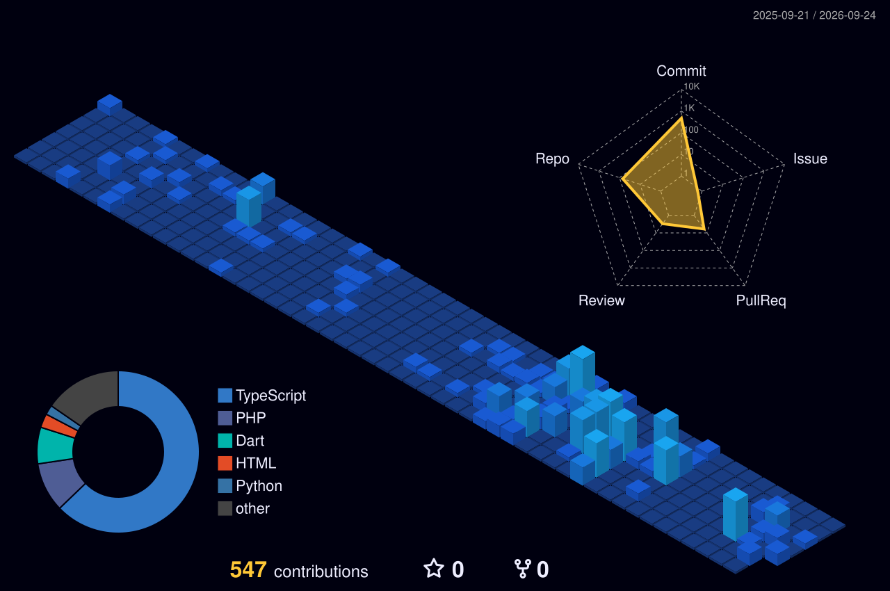

 

**Full-stack &amp; mobile developer** building useful products with clean architecture, thoughtful UX, and practical AI.

  
  
  

---

## About Me

I'm pursuing a D4 in **Smart City Information Systems** at [Politeknik Negeri Indramayu](https://www.polindra.ac.id/) (GPA **3.98/4.00**). I enjoy taking ideas from problem discovery through implementation—whether that's a business workflow, a useful web product, or an AI-assisted tool.

My work ranges from POS and e-commerce systems for local businesses to decision-support tools using fuzzy logic and machine learning. I also served as **Head of Research &amp; Development** at HIMA-SIKC, leading technical initiatives and mentoring peers.

- 🧑‍💻 **Building:** full-stack products, mobile apps, and practical AI features
- 🌱 **Exploring:** cloud architecture, microservices, and ML pipelines
- 💬 **Happy to discuss:** Laravel, Next.js, Flutter, REST APIs, and system design

 

Illustration by [Storyset](https://storyset.com/illustration/javascript-frameworks/amico)

---

## Toolkit

| Area | Tools I use |
|---|---|
| **Languages** | PHP, JavaScript, Dart, Python, Go, Java, C++, HTML/CSS |
| **Web** | Laravel 12, React, Next.js, Vue.js, Tailwind CSS, Alpine.js |
| **Backend &amp; APIs** | FastAPI, Node.js, Express.js, REST, GraphQL |
| **Mobile** | Flutter, Firebase SDK |
| **Data &amp; AI** | MySQL, PostgreSQL, Supabase, SQLite, Firebase, Gemini, fuzzy logic |
| **Delivery** | Git, Docker, GitHub Actions, Vercel, Render, Railway, Midtrans |

---

## Selected Work

Three projects that show how I approach product UX, business workflows, and developer tooling.

### [Kompresio](https://kompresio-nextjs.vercel.app/)

A privacy-first image toolkit for compression, conversion, resizing, metadata cleanup, batch ZIP export, and image-to-PDF. Core processing happens in the browser, so files stay on the user's device.

**Next.js 16 · React 19 · TypeScript · Tailwind CSS 4 · Vitest**
[Live demo](https://kompresio-nextjs.vercel.app/) · [Source code](https://github.com/muris11/kompresio)

 

### [POS UMKM](https://github.com/muris11/Pos-UMKM-Laravel-12)

A point-of-sale system for Indonesian small businesses, with multi-store support, inventory reporting, cashier workflows, and Midtrans payment integration.

**Laravel 12 · PHP · MySQL · Tailwind CSS · Alpine.js · Midtrans**
[Explore the repository](https://github.com/muris11/Pos-UMKM-Laravel-12)

### [anti-ai-slop](https://github.com/muris11/anti-ai-slop)

An open-source toolkit that helps AI coding agents avoid generic interface, writing, and code patterns while keeping room for distinctive design decisions.

**17 agent skills · CLI installer · GitHub Actions CI**
[Source code](https://github.com/muris11/anti-ai-slop) · [Install via skills.sh](https://www.skills.sh/muris11/anti-ai-slop)

---

## Experience

| Role | Organization | Period |
|---|---|---|
| Head of R&amp;D | HIMA-SIKC, Polindra | Aug 2024 – Jul 2025 |
| General Secretary | Mahasiswa Jabodetabek Polindra | Jun 2024 – Jun 2025 |
| Lab Assistant Intern | Universitas Telkom Purwokerto | Jan 2022 – Apr 2022 |
| Young Staff (Foreign Affairs) | BEM Polindra | 2023 – 2024 |

## Education

| Institution | Program | Duration | Notes |
|---|---|---|---|
| Politeknik Negeri Indramayu | D4 Smart City Information Systems | 2023 – Present | GPA 3.98/4.00 |
| SMKS Telekomunikasi Telesandi | TKJ – Computer &amp; Network Engineering | 2020 – 2023 | Mikrotik UKK, IoT Project |
| SMPN 06 Cibitung | Junior High School | 2017 – 2020 | — |
| SDN Wanasari 01 | Primary School | 2011 – 2017 | — |

## Certifications

| Certificate | Issuer |
|---|---|
| Belajar Back-End Pemula dengan JavaScript | Dicoding |
| Fundamental Deep Learning | Pijak x IBM SkillsBuild |
| Membangun Sistem Machine Learning | Pijak by Dicoding |
| AI Praktis untuk Produktivitas | Dicoding |

---

## GitHub Stats

<!--START_SECTION:waka-->
<!--END_SECTION:waka-->

## 3D Contribution City

 

 

## GitHub Metrics

 

## Contribution Snake

<picture>
  <source media="(prefers-color-scheme: dark)" srcset="https://raw.githubusercontent.com/muris11/muris11/output/github-contribution-grid-snake-dark.svg" />
  
</picture>

---

## Writing

Notes and articles, updated automatically from my DEV feed.

<!-- BLOG-POST-LIST:START -->
<!-- BLOG-POST-LIST:END -->

## Connect

Interested in building something useful together? [Get in touch](mailto:rifqysaputra1102@gmail.com) or find me here:

